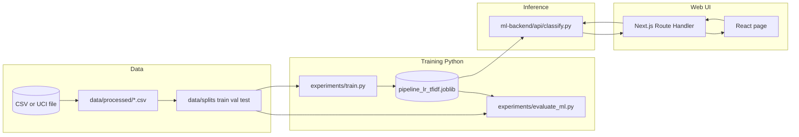

# Smishing detection system — end-to-end overview and tech stack

This document explains how the SMS smishing classifier works **from labelled data → NLP featurisation → supervised ML → saved model → web UI inference**, including the technologies in use.

---

## 1. High-level architecture

At a glance, three layers cooperate:

| Layer | Role |
|-------|------|
| **Python (research / training)** | Load data, preprocess text, extract TF-IDF features, train a `scikit-learn` pipeline, evaluate, save `*.joblib`. |
| **Python (inference)** | Load the same pipeline from disk and score arbitrary SMS strings; optionally explain the decision in plain language. |
| **Web app (Next.js)** | Offers a textarea to paste SMS text, calls `/api/classify`, shows label, human-readable score, and short explanations. |



The **canonical trained model artifact** consumed by inference and documented here is:

- `ml-backend/artifacts/pipeline_lr_tfidf.joblib`

Metadata about the training run (paths, timestamps, validation metrics) is saved alongside:

- `ml-backend/artifacts/pipeline_lr_tfidf.meta.json`

---

## 2. Data: sources, formats, and cleaning

### 2.1 Primary dataset (CSV “Dataset1” style)

Typical location in this repo:

- `ml-backend/dataset/Dataset1.csv`

Columns (minimum):

| Column | Meaning |
|--------|--------|
| `label` | String labels `benign` or `smishing` (your project convention). |
| `message` | Raw SMS-like text to classify. |
| `feature_notes` | Optional; used for dataset documentation — **ignored by the training loaders** when building the modelling table. |

**Normalisation:** `scripts/load_dataset1.py` reads the CSV and produces a modelling table where:

- `benign → 0` (negative / safe class),
- `smishing → 1` (positive / malicious class for metrics),
- Rows are deduplicated on `(label, message)`.

Output example:

- `data/processed/dataset1.csv` (typically includes `label`, `message`, and a `source` column).

These integer labels (`0` / `1`) are required by `scripts/make_splits.py`, `experiments/train.py`, and `experiments/evaluate_ml.py`.

### 2.2 Alternate dataset (UCI SMS Spam Collection)

Optional preset for the same pipeline shape:

- Raw file (tab-separated, no header): default path `data/raw/SMSSpamCollection`.
- Loaded by `scripts/load_uci_sms.py`; labels `ham/spam` are mapped to `0` / `1`; output commonly `data/processed/uci_sms.csv`.

### 2.3 Train / validation / test splits

`scripts/make_splits.py` performs **stratified** random splitting (defaults **70% / 15% / 15%**) so approximate class proportions are preserved across splits:

- `data/splits/train.csv` — used to **fit** the vectoriser and classifier.
- `data/splits/val.csv` — used for **during-training sanity checks** in `experiments/train.py` (classification report printed and stored in `.meta.json`). **Hyperparameter search is not implemented** in this minimal setup; validation is informational.
- `data/splits/test.csv` — held-out evaluation in `experiments/evaluate_ml.py` (**no fitting** uses this split in the shipped scripts).

**Important:** Repeated training runs regenerate splits from whatever **processed CSV** was last produced, unless you rerun loading with updated raw data first.

---

## 3. NLP: what happens to SMS text?

“NLP” in this project is **classical lexical featurisation** (bags of weighted words/n‑grams), not a large language model.

### 3.1 Preprocessing (`ml-backend/preprocessing/clean_text.py`)

Function **`preprocess_sms_to_string`** (and related helpers):

- Converts text to lowercase.
- Removes punctuation/symbols broadly (regex), normalises whitespace.
- Tokenises by splitting on spaces after cleanup.
- **Removes a built-in English stopword list** (optional override possible at API level via vectoriser helpers; training uses defaults unless you extend the code paths).
- Can optionally drop pure numeric tokens (`keep_numbers` flag in vectoriser wrappers).

Purpose: shrink vocabulary noise while keeping discriminative SMS tokens (banks, OTP, URLs as tokens if still present before punctuation stripping, etc.).

### 3.2 Feature extraction: TF-IDF (`ml-backend/feature-extraction/tfidf_features.py`)

Training builds a **`sklearn.pipeline.Pipeline`** with steps:

1. **`TfidfVectorizer`** (step name `"tfidf"` — important for tooling that inspects saved models):
   - **Preprocessor**: calls `preprocess_sms_to_string` for each incoming document via a picklable `functools.partial` wrapper (needed for **`joblib` serialisation** of the fitted pipeline).
   - **Tokenizer**: `str.split` (tokens expected as space-separated after preprocessing).
   - **Important vectoriser knobs** (defaults encapsulated in `TfidfConfig`):
     - `max_features`: up to 20,000 vocab items (top-weighted globally after fitting on train).
     - `ngram_range`: `(1, 2)` → unigrams + bigrams.
     - `min_df`: `2` (ignore extremely rare tokens on the training set unless they appear twice).
     - `max_df`: `0.95` (drop overly common tokens).
     - `sublinear_tf`: TF compression (`1 + log(tf)` flavour of weighting semantics per sklearn conventions).

2. **Classifier** (`"clf"` step): **`LogisticRegression`** with `class_weight="balanced"` — mitigates class imbalance by reweighting loss toward the minority label during training.

**During training:**

- Fit **only on `train` messages** (`Pipeline.fit`).
- Validation and test use **`transform`** on the fitted vectoriser inside the pipeline (automatic when calling `predict` / `predict_proba`).

### 3.3 What the model stores

After fitting, each **term** learned from training data carries a coefficient in logistic regression tied to predicting class `1` (smishing) vs `0`. **Those coefficients + the TF-IDF weights for one message** underpin the explanatory summaries at inference time (see §6).

---

## 4. Machine learning: training, metrics, artefacts

### 4.1 Training script

`experiments/train.py`:

1. Loads `train.csv` and `val.csv`.
2. Builds the pipeline via `load_tfidf_features_module()` / `build_tfidf_pipeline()`.
3. Fits on training rows.
4. Prints validation metrics derived from **`predict`** on validation messages.
5. **`joblib.dump`** writes the fitted pipeline path (default):

   ```text
   ml-backend/artifacts/pipeline_lr_tfidf.joblib
   ```

6. Writes JSON metadata **`pipeline_lr_tfidf.meta.json`** (UTC timestamp, splits used, coarse validation aggregates).

Because the preprocessor is picklable, **inference repeats the identical text normalisation**, avoiding train/serve skew.

### 4.2 Evaluation script

`experiments/evaluate_ml.py`:

- Loads the saved **`joblib`** pipeline.
- Scores **`test.csv`** (no training).
- By default (**without** `--overwrite`), writes **versioned filenames** including a UTC timestamp to avoid overwriting past runs:

  - `reports/metrics_ml_test_<YYYYMMDD_HHMMSS>.json`
  - `reports/pred_ml_test_<YYYYMMDD_HHMMSS>.csv`

- With `--overwrite`, uses:

  - `reports/metrics_ml_test.json`
  - `reports/pred_ml_test.csv`

Uses **paired importance at load**: it ensures the pickled `tfidf_features` module is importable so `joblib.load` succeeds on Windows/Python 3.x dynamic import paths used in development.

### 4.3 One-shot orchestration

`scripts/train_full_pipeline.py` stitches:

```
load_* → make_splits → train → evaluate_ml
```

with `--dataset {dataset1,uci}`, optional `--input`, optional `--eval-overwrite`. See **`RUN_PIPELINE.md`** for invocation examples.

### 4.4 Evaluation metrics (conceptual)

The JSON reports **`metrics_pos1`**: precision, recall, F1, accuracy with **positive class = smishing = `1`**. Confusion-matrix cells (`tn/fp/fn/tp`) are included for auditing false positives vs false negatives.

---

## 5. Inference: scoring new SMS (`ml-backend/api/classify.py`)

At runtime inference:

1. **`joblib.load`** restores the **`Pipeline`**.
2. `predict([text])` yields class `0` or `1`.
3. **`predict_proba`** (binary logistic regression) yields `p(smishing)` for the message (when available).

Explanatory logic is layered on top inside the same classify script:

- Under the hood numeric token contributions derive from multiplying sparse TF-IDF weights by logistic coefficients (see **`ml-backend/models/explain_lr_tfidf.py`**).
- **`classify.py` converts technical scores into**:

  - `risk_percent_smishing` — rounded whole-number overall score,
  - `verdict_plain` — short prose summary,
  - `signals_toward_smishing` / `signals_toward_benign` — bullet strings with **percentage shares split among surfaced phrases**, phrased for human readers (`explanation_note` clarifies interpretation limits).

CLI contract: **`classify.py` reads JSON on stdin**, writes JSON on stdout — designed to be spawned by Node.

---

## 6. Web application — tech stack and integration

Location: **`webapp/smishui`** (created with Next.js App Router).

| Technology | Role |
|------------|------|
| **Next.js ~16.x** (`next`) | Framework: App Router routes, `/api/classify` server route handler. |
| **React ~19.x** (`react`, `react-dom`) | Client UI rendering; main page (`app/page.tsx`) is a client component for form state/fetching. |
| **TypeScript** | Typed React + route code. |
| **Tailwind CSS v4** + **PostCSS** | Utility-first styling (`app/globals.css` imports Tailwind). |
| **ESLint / eslint-config-next** | Linting. |

Runtime bridge:

`app/api/classify/route.ts`:

- Resolves **repository root** as two directories above `process.cwd()` (where `npm run dev` runs from inside `smishui`).
- Spawns **`.venv/Scripts/python.exe`** with argument **`ml-backend/api/classify.py`**.
- Passes `{ text, top_k, artifact }` JSON on stdin (`artifact` defaults to **`ml-backend/artifacts/pipeline_lr_tfidf.joblib`** aligned with Python training defaults).

Frontend:

- `POST /api/classify` with `{ text }` renders label, readability-focused lines, bullets, caveat note.

Limitations intentionally accepted in this MVP:

| Limitation | Implication |
|------------|---------------|
| **Process spawn per request** | Simpler ops; heavier latency than embedding Python as a daemon or using WASM / pure JS classifier. |
| **Local-first** | Intended for dissertation / demos on your machine — production would need hardened paths, pooling, GPU unneeded here. |

---

## 7. Supporting Python tooling (research utilities)

Secondary modules retained for exploration (not wired into the consolidated UI path):

- `ml-backend/models/train_model.py` — historic **Naive Bayes + TF-IDF** example path.
- `ml-backend/rule-engine/rules.py` — heuristic baseline (comparison scripts may exist under `experiments/` but aren’t central to today’s classifier UI).

Those demonstrate alternative baselines vs the **Logistic Regression TF-IDF** productionised path.

---

## 8. Python dependency stack (`ml-backend/requirements.txt`)

Declared packages (pinned versions intentionally minimal in-repo; install creates concrete versions):

| Package | Typical role |
|---------|----------------|
| **numpy** | Numerical underpinning inside sklearn scipy stack. |
| **pandas** | CSV IO and tabular preprocessing in loaders/splits scripts. |
| **scikit-learn** | Pipeline, TF-IDF, LogisticRegression, metrics, stratified splits helpers. |
| **joblib** | Fast persistence of sklearn estimators (`*.joblib`). |
| **scipy** | Scientific utilities (historic stats-heavy experiment scripts include scipy pieces). |

Run everything under a dedicated virtual environment (recommended **Python 3.11+**, project tested on **Python 3.13** in development).

---

## 9. Operational quick reference

### Training from scratch after dataset edits

Prefer:

```bash
scripts/train_full_pipeline.py --dataset dataset1
```

(Optional custom CSV)

```bash
scripts/train_full_pipeline.py --dataset dataset1 --input path\to\my.csv
```

### Running the classifier UI locally

Terminal A (repository root conventions):

```bash
cd webapp/smishui
npm run dev
```

Browser: **`http://localhost:3000`**

Ensure **`ml-backend/artifacts/pipeline_lr_tfidf.joblib`** exists and root-level **`.venv`** matches the spawned interpreter referenced in the API route handler.

Detailed step-by-step without the orchestrator: **`RUN_PIPELINE.md`**.

---

## 10. What this system deliberately is *not* (scope clarity)

For thesis transparency:

- Not a transformer / LLM classifier — embeddings are sparse TF-IDF.
- Explainability strings are **post-hoc token-level attributions**, not causal proof of phishing.
- Estimated **risk percent** merges model probability / decision boundary wording for readability — always pair with disclaimers (`explanation_note` from API).

---

## 11. File map (mental model)

```
data/
  raw/                # Manual placement of UCI file
  processed/          # Unified CSV ready for modelling
  splits/             # train.csv, val.csv, test.csv

ml-backend/
  preprocessing/      # SMS text normalization
  feature-extraction/   # TF-IDF + LR pipeline factory
  models/               # Explanation utilities (+ historic NB trainer)
  api/                  # classify.py inference bridge for Node
  artifacts/            # pipeline_lr_tfidf.joblib + .meta.json
  dataset/              # authored CSV(s)

experiments/
  train.py
  evaluate_ml.py
  _load_modules.py       # Repo-root-relative dynamic imports

reports/                 # Versioned ML evaluation JSON / CSV traces

scripts/
  load_dataset1.py
  load_uci_sms.py
  make_splits.py
  train_full_pipeline.py # End-to-end convenience

webapp/smishui/
  app/page.tsx           # UI
  app/api/classify/route.ts  # Spawns classify.py

docs/
  SYSTEM_AND_TECH_STACK.md   # ← this document
```

---

*End of overview.*
